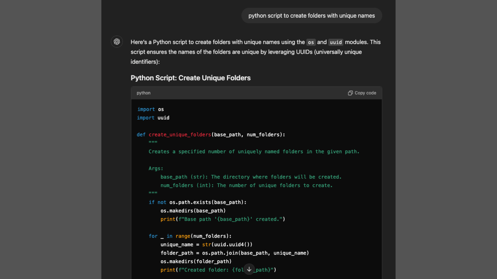
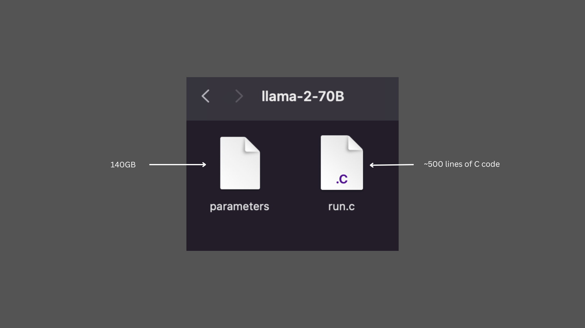
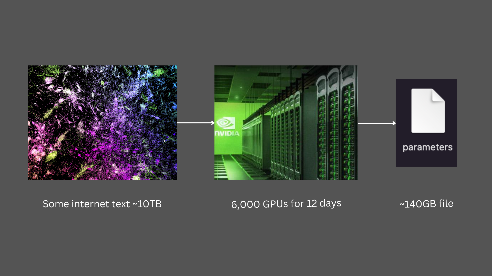
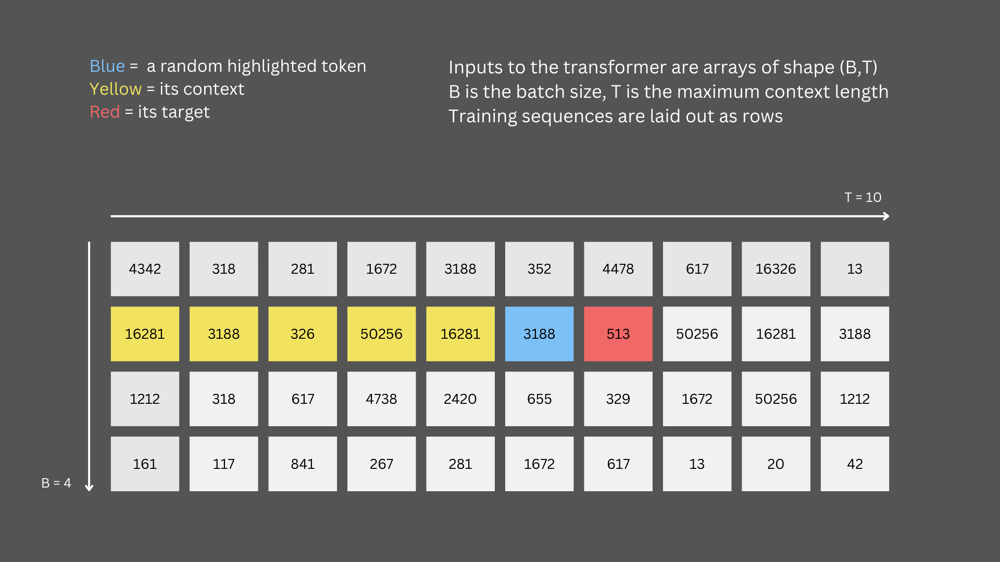
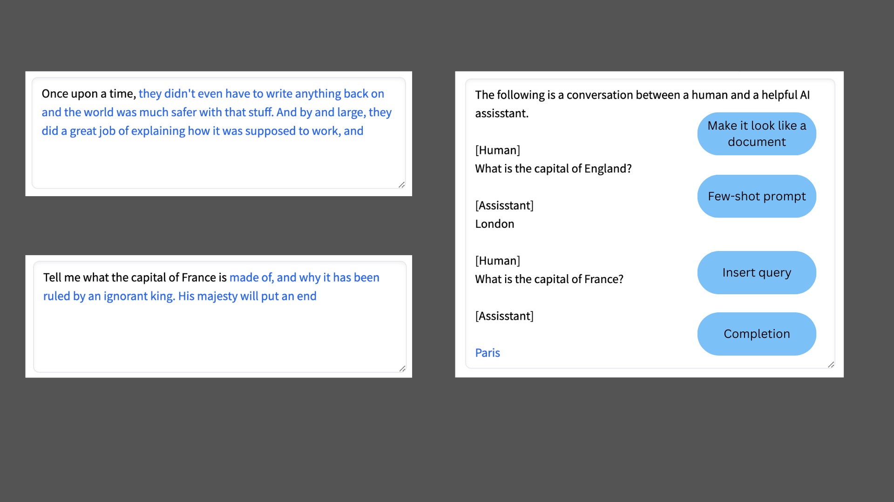
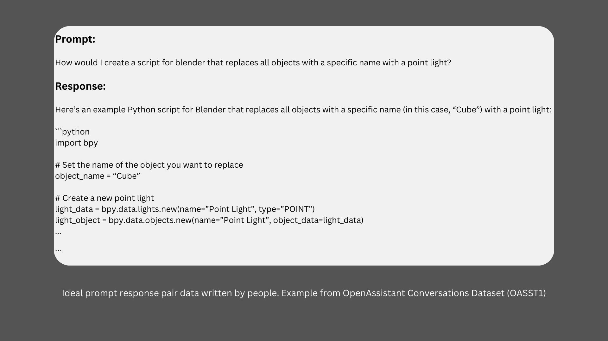
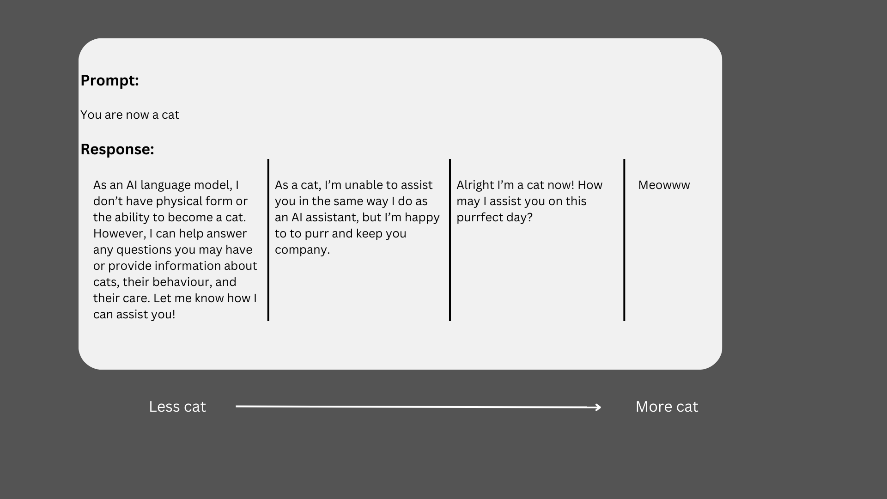
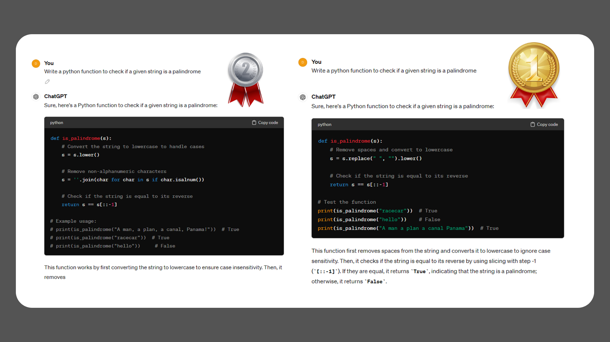
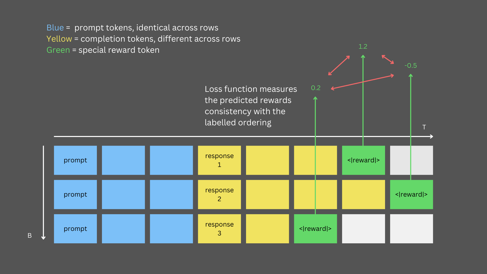
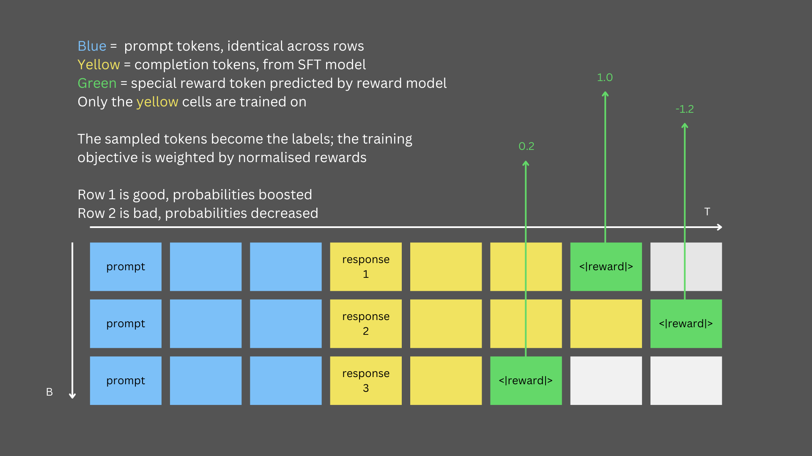

# Demystifying LLMs 

 

## TL; DR

 

Super powerful LLM Assistant models are trained in two stages. Data quantity is crucial to training great lanuguage models, 
whilst data quality transforms these base models into helpful assistant models.

 

(1) Pretraining: on unlabelled internet scale data learns really good word representations and semantics. It's a language model, but bigger.

 

(2) Post-training: on high-quality labelled data pushes the model generation behaviour to be that of a helpful assistant.
 

 

 

## Large Language Models (LLMs) are crazy. 

 

 

 

We can give them instructions, or ask them questions, and they will generate plausible (and increasingly accurate) responses. The rate of development is **wild** and the models are rapidly becoming more and more capable, but we'll save that for another time.

  

This article looks to lift the lid on what's happening under-the-hood to allow these models to behave this way. It's my attempt to distil a number of things I've watched and read about LLMs that I've found useful when thinking about how LLMs are doing what they're doing. In particular most of this post is inspired by Andrej Karpathy's videos [Intro to Large Language Models][intro-to-llms] and [State of GPT][state-of-gpt], Andrej is a phenomenal AI researcher/practitioner/educator and covers this in much better detail than I can.

 

## GPT Assistants

 

When we think of LLMs we typically think of ChatGPT or Claude, etc. These are GPT assistant models (well applications but that's for another time too) and they are actually sort of many models in one.

 

 

The key to a really good language model, a really good statistical representation of word (or token) sequences and semantic relationships between them, is pretraining (and attention and the transformer architecture etc). The key to making these language models the useful and capable LLMs we know and love is post-training, the combination of supervised finetuning through to reinforcement learning, and importantly the **high quality datasets** used in these subsequent training stages.

 

## Pretraining

 

Pretraining learns the statistical relationship between words/tokens so that the model will predict or generate the most likely next word/token, given the sequence of previous words/tokens. Think really (really really) good predictive text.

 

 

Whilst the transformer architecture, the attention mechanism, and  training LLMs can be quite tricky to comprehend and actually do, LLMs can be thought of in quite simple terms too, just two files. Pretraining learns the weights of the model which for llama-2-70B boils down, at some level, to a 140GB file. That weights file can then be combined with the model code (which could be ~500 lines of C code), which specifies the architecture of the model, how to load the weights, and how to perform inference and there you have an LLM. Well an LLM base model at least.

 

 

Pretraining can also (sort of) be thought of in fairly simple terms. To follow on from the weights file analogy above; pretraining takes the internet (a lot of text), runs it through lots of GPUs for a long time, and end's up with a 'lossy' compresion of the internet - the weights file. This is 'lossy' as in contrast to normal compression when you uncompress the compressed file you get exactly what you started with, in the case of LLMs when you 'uncompress' or generate from the base model you only get an approximation of what you had before.

 

### Learning to predict the next token

 

GPTs are particularly good language models because they scale well and learn efficiently. The task is to predict the next token, based on some context (history of tokens). Base model pretraining is unsupervised/semi-supervised in the sense that it doesn't require labelled training data, but that each next token is the target/'truth'-label for the current token. Next token prediction is then efficiently learnt across all (batches of) tokens.

 

 

### Base models aren't assistant models

 

Base models are next token predictors, they take the current context and predict the most likely next token. They don't (yet) take in questions and output answers, they aren't assistant models. However, they can be 'tricked' or guided into behaving like them. By setting up clever prompts, the most likely next token can be 'pushed' towards exhibiting a desired behaviour. 

 

 

## Supervised finetuning (SFT)

 

It's all about the data. Unlike pretraining, which is on high volume low quality data, SFT uses low volume high quality data. This is the start of the magic of turning the really great pretrained language models into helpful LLM assistants. By finetuning base models with really high quality curated datasets of prompt-response pairs, written by human experts, the behaviour of these models can be transformed. Instead of being simple next token predictors, when given a question as the context LLM assistants can generate an answer as the output. These models can be pushed towards question-answer inputs-outputs because of how the SFT datasets are constructed.

 

 

Another way to think of this SFT is as a form of 'alignment'. LLMs will look to 'mimic' the SFT dataset. If the input is a question and the target output is a well crafted, accurate, verbose response, the SFT process steers the LLM to generate answers in this style. Alternatively if the input is an instruction of how the model should respond and the target output is... not so helpful, the model will look to 'mimic' that too. This [Research x Product talk][research-x-product] from OpenAI put me onto this way of thinking with quite a fun example. 

 

 

## Reinforcement learning from human feedback (RLFH)

 

The combination of reward modelling and reinforcement learning are together RLHF, this is what supercharges the capabilities of LLM assistants. 

 

### Reward modelling

 

The reward modelling step is again about data quality. By generating multiple responses for the same input we can then construct a reward modelling dataset by getting people to vote on, or rank, the different generated responses. This voting/discrimination task is easier for people to perform, when compared to creating ideal reponses for prompts as in SFT, so larger volume comparisons datasets are easier to create.

 

 

The reward model then learns to predict a 'reward' value for the given prompt-responses, that is consistent with the human ranking/preference.

 

 

### Reinforcement learning

 

Reinforcement learning is then carried out with respect to the reward model. After training the reward model to be consistent with the human rankings, it can then be used to to score the generated response for any arbitrary input, this is then used to scale the token probabilities.

 

 

<!-- Links -->
[intro-to-llms]: https://www.youtube.com/watch?v=zjkBMFhNj_g&ab_channel=AndrejKarpathy
[state-of-gpt]: https://www.youtube.com/watch?v=bZQun8Y4L2A&ab_channel=MicrosoftDeveloper
[research-x-product]: https://www.youtube.com/watch?v=YXiRbRacTF0&ab_channel=OpenAI
