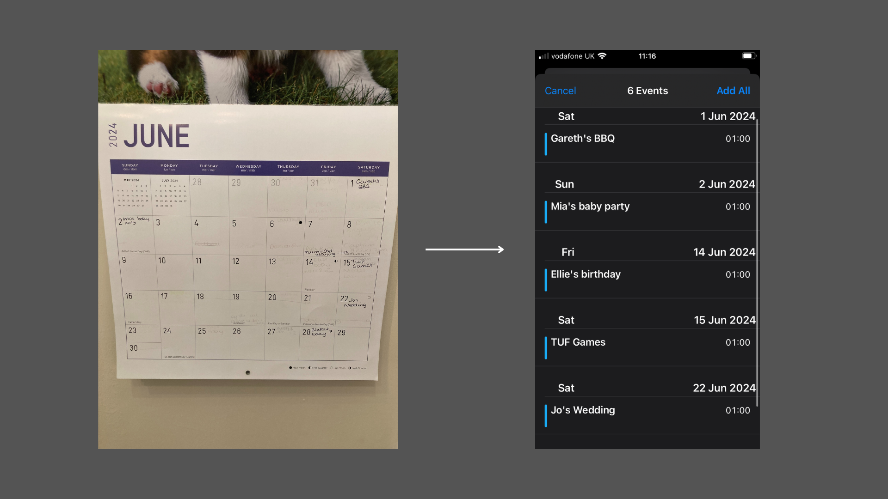
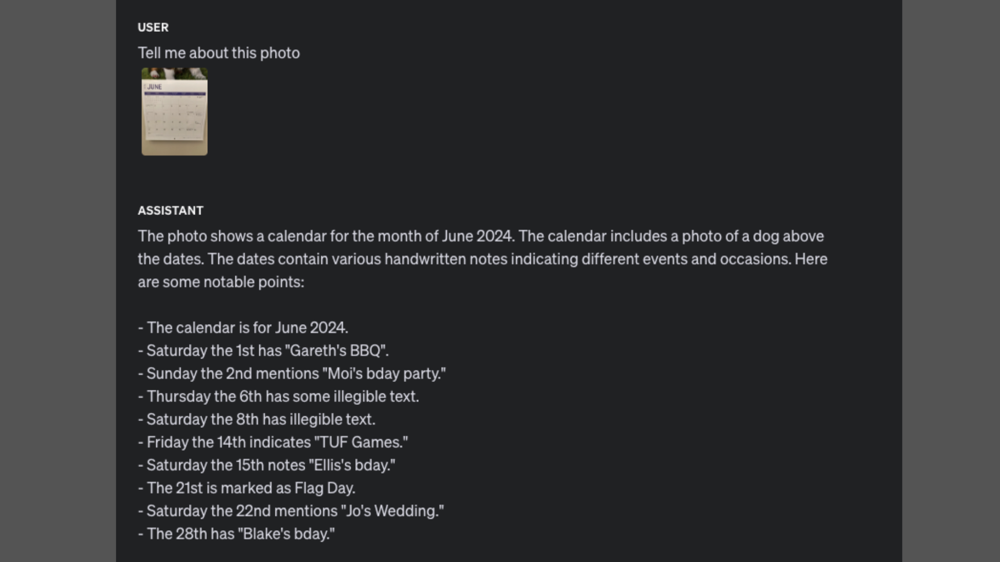

# Multi Modal Models

 

 

 

## TL;DR

 

I was playing around with the image capabilities of GPT-4o and made a [calendar update app][calendar-app-github-link].

 

## GPT-4o can see

 

Shortly after the release of GPT-4o I wanted to test out its image capabilities. I was immediately impressed. I started by sending the following picture of my analogue, handwritten, calendar. Then simply asked the model to tell me about the photo to see what it came back with.

 

 

 

 

 

It correctly identifies that this is a calendar, and the right month and year. It lists the events written on different days and says when the text is hard to see / illegible. This faint text is actually an imprint from having been written on the previous month, and some of it is (almost) correctly picked out. It even let's me know that there's a picture of a dog above the calendar from what little it can see!

 

## What is this sorcery?

 

I think I've got a fairly good 'intuition' for what's happening with the text side of LLMs (see [my earlier blog post][demystifying-llms-link]) but I didn't know how images were incorporated as part of the input, and training process. That is until Meta lifted the lid on vision models with their [Llama 3.2 release][meta-llama-link], in which they say:

 

_"To add image input support, we trained a set of adapter weights that integrate the pre-trained image encoder into the pre-trained language model. The adapter consists of a series of cross-attention layers that feed image encoder representations into the language model. We trained the adapter on text-image pairs to align the image representations with the language representations. During adapter training, we also updated the parameters of the image encoder, but intentionally did not update the language-model parameters. "_

 

So an adapter model, a pre-trained image encoder, and text-image alignment (kinda feels like [word embeddings][procrustes-link] all over again), got it!

 

## A calendar app?

 

I've wanted to create a calendar app for a while. The basic concept would be to take a photo of a physical calendar with your phone, and have it extract the events and update your phone calendar. I wanted it to be an app, as applications require more engineering and thought than just showing off the capabilities. All of the constituent parts to make it work, in theory, existed but composing them into a useful app would require, combining them in the right way, error handling, formatting the output correctly. I thought it would be a fun pet project. 

 

In the pre GPT-4o (or multi-modal LLM) days the basic architecture of the backend went, in my head, something like this:

 

<li> Image classification for telling if the photo was of a calendar or not. </li>
<li> Performing optical character recognition (OCR) to extract the text from the image. </li>
<li> Parsing and processing the extracted text and formatting it as a calendar update. </li>

 

 

 

The backend could be a standalone API call, composed of different API calls for the different components (classification, OCR, etc). A nice mini microservices application.

 

The image classification model could be simple binary classification, calendar yes or no.

 

However, the text extraction could raise some issues. It's been quite a while since I've implemented anything in the OCR space, and whilst OCR on well formatted documents with printed text (e.g. scanned contracts) was fairly straightforwards and mostly solved, the calendar use case poses a number of potential problems. The first is that this is an example of OCR 'in the wild' where the text can be anywhere within an image. This type of OCR itself is usually a combination of text detection and then character recognition. The second potential problem is that this text is handwritten, which is messier and harder to decipher than typed text. The third potential problem, building on the first, is localisation and combination. My last previous exposure to OCR was through [tesseract][tesseract-link] and [Amazon's textract service][textract-link], and whilst both were good at text detection and recognition, and providing the bounding boxes for where that text is, I anticipated that there might be an issue with assigning which recognised text, and event, belonged to which date.

 

It turns out all I had to do was wait for multi modal LLMs. Well almost all I had to do.

 

## LLM Applications

 

With the image capabilities of GPT-4o my envisioned multi model application became a multi-modal model call. But as alluded to before whilst showing off the capabilities of the model is easy ('tell me about this image'), building this into an application takes a little bit (but not that much) more work. LLMs are generative and non-deterministic, they produce something different with each call. Applications (as they are today) on the other hand rely on structured data that conforms to expected input/output types and definitions.

 

 

 

To use LLMs within applications we need to get reliable outputs that can be used as part of a normal code workflow. This can be done, in the first instance, with a combination of prompt-engineering and output parsing. (Another option for generating the right type/style of output is to fine-tune a base model with a dataset of input/output pairs that reflect the inputs you expect in your application and the desired output format, but this is often unecessary)

 

## An example application

 

With the image capabilities of GPT-4o creating the app backend was a simple case of creating a FastAPI server containing a route that wraps the LLM API call and output parsing. Here I got the model to output JSON formatted text of the events and corresponding dates, and used LangChain to parse this into a python dictionary that could then be manipulated into `.ics` calendar update format.

 

For the frontend I had a go at creating an [expo][expo-link] app. I've simply extended the default expo app that gets created when you create a new project with a camera view that takes a picture and sends it to the backend.

 

N.B. This app doesn't fully work yet. It can send the picture to the backend, and the backend can process and extract the events and dates, but properly handling the calendar update needs thought. It currently creates a local `.ics` file, which could be sent as an email attachment which does update the calendar, but I think it would be neater to natively update the calendar. One thing that I think is also worth exploring in future is how to edit/correct the extracted events. They aren't always exactly right, so an easy way to update these would be good, and ideally be an important part of the feedback loop.

 

<!-- links -->
[calendar-app-github-link]: https://github.com/domchao/calendar-app 
[demystifying-llms-link]: ../_1_demystifying_llms/_1_demystifying_llms.html
[meta-llama-link]: https://ai.meta.com/blog/llama-3-2-connect-2024-vision-edge-mobile-devices/
[procrustes-link]: https://arxiv.org/abs/1805.11222
[tesseract-link]: https://github.com/tesseract-ocr/tesseract
[textract-link]: https://aws.amazon.com/textract/
[expo-link]: https://expo.dev/