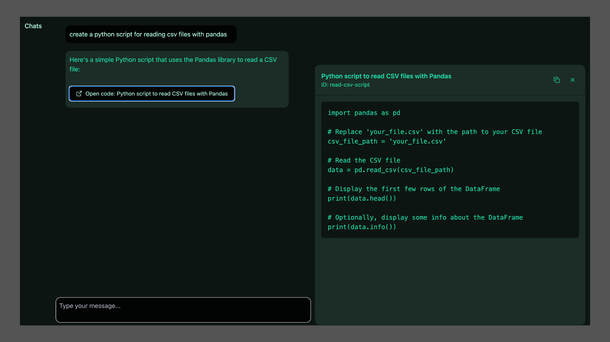

# Copying Claude

<br>

 

<br>

## TL;DR

<br>

I had a go at copying the [Claude][claude-link] app, creating [my own chat app][llm-chat-app-link] (with a lot of Claude's help!) that gets an LLM to output artifacts if necessary and have the frontend render them side-by-side with the rest of the conversation.

<br>

## Models vs Applications

<br>

Before we dive into the chat app I just wanted to say a quick piece about the current state of play of commercial GenAI, in particular that the terminology is pretty inconsistent and confusing.

<br>

ChatGPT and Claude are applications. They encompass (in amongst many things I'm sure to miss) the frontend code and logic for what you see and are able to do, user managment and e.g. history of different conversations, maintaining a single conversation history for providing the conversation context to the models, and actually calling the llms with the user input and handling the model outputs/response.

<br>

These applications are powered by models like GPT-4o or Claude-3.5-Sonnet. Models do the generative magic, and applications wrap-around the model outputs and make them more easy-to-use and user-friendly. 

<br>

Models and model-powered applications are often wrongly conflated and I think making this separation clearer and more obvious will actually help people understand these tools and how to use them better.

<br>

## Why copy Claude?

<br>

Basically because I think it's great. I love the side-by-side nature of co-creating something with a model but having the actual artifact you're working on separate to the conversation about it.

<br>

I've been creating GenAI applications at work to help people use LLMs to perform certain tasks, but these have mostly been what I'd call 'form-based' applications. How it typically goes is essentially doing some prompt-engineering alongside the end user, to understand the problem they trying to solve, and finding the best ways to prompt the LLMs to help achieve that. For example this could be adding in some tone of voice wording so that the generated output 'sounds right', or finding ways to insert knowledge to ground the output in the 'facts' we want it to talk about. The end result is often some 'form' of inputs that users put whatever they need in to, that gets combined in the backend into the 'best-practice' prompt so that the output generation is guided in the right way and sticks to the right information. 

<br>

This is quick to do and is a great start, but it has limitations. The most obvious one is that this is 'single-shot' generation. You give the inputs once and get the output once, there's limited room to iterate. This also isn't how we're used to interacting with models as they're typically in chat-based applications like Claude or ChatGPT. Chat and iteration are really powerful ways of working with these models so I wanted to explore how I could replicate this for my internal use cases - hence copying Claude.

<br>

## How does Claude work?

<br>

In trying to copy Claude, so that I could create an internal chat application, I set about trying to reverse-engineer what was going on. I was able to do this using the browser developer tools and inspecting the different page elements and network calls.

<br>

Here are the key features I found (N.B. ChatGPT is structured very similarly):
- There's a `/new` URL route for the initial page (that you get re-directed to when you 'start a new chat')
- New chats - when populated - get re-directed to a `/chat/uuid/` URL
- When you load a chat page at one of these URLs the page data JSON object that gets sent to the browser has a `chat_messages` field that contains the conversation history (content and associated metadata).
- When you get Claude to create an artifact it's contained within the normal model response, wrapped in `<antArtifact>` tags.

<br>

(Truncated) example of normal `chat_messages` JSON:
```json
{
    "chat_messages": [
        {
            "uuid": "3daab703-ea7d-4b30-a424-5a93e307e8ba",
            "content": [
                {
                    "type": "text",
                    "text": "Tell me a joke"
                }
            ],
            "sender": "human",
            "index": 0,
        },
        {
            "uuid": "09f073ee-a198-4be4-8283-3b0bb41af3de",
            "content": [
                {
                    "type": "text",
                    "text": " Why don't programmers like nature? It has too many bugs!"
                }
            ],
            "sender": "assistant",
            "index": 1,
        },
    ]
}
```

<br>

Example with an artifact:
```json
{
    "chat_messages": [
        {
            "uuid": "0a450358-ef7b-450d-834e-822ecb870a3b",
            "content": [
                {
                    "type": "text",
                    "text": "create me a python script to open csv files"
                }
            ],
            "sender": "human",
            "index": 0,
        },
        {
            "uuid": "a1bd40cc-f3d5-4629-8872-4e98a93a9890",
            "content": [
                {
                    "type": "text",
                    "text": " \n\n<antArtifact identifier=\"csv-handler\" type=\"application/vnd.ant.code\" language=\"python\" title=\"CSV File Handler\">\nimport csv\nimport pandas as pd\nfrom typing import List, Dict, Union\nimport os\n\nclass CSVHandler:\n    def __init__(self, filepath: str):\n        \"\"\"\n        Initialize the CSV handler with a file path.\n        \n        Args:\n            filepath (str): Path to the CSV file\n        \"\"\"\n        self.filepath = filepath\n        \n    def read_with_csv(self) -> List[Dict]:\n        \"\"\"\n        Read CSV file using the csv module.\n        \n        Returns:\n            List[Dict]: List of dictionaries where each dictionary represents a row\n        \"\"\"\n        if not os.path.exists(self.filepath):\n            raise FileNotFoundError(f\"File {self.filepath} not found\")\n            \n        with open(self.filepath, 'r', newline='', encoding='utf-8') as file:\n            reader = csv.DictReader(file)\n            return list(reader)\n            \n    def read_with_pandas(self) -> pd.DataFrame:\n        \"\"\"\n        Read CSV file using pandas.\n        \n        Returns:\n            pd.DataFrame: DataFrame containing the CSV data\n        \"\"\"\n        return pd.read_csv(self.filepath)\n        \n    def write_csv(self, data: List[Dict], output_path: str) -> None:\n        \"\"\"\n        Write data to a CSV file.\n        \n        Args:\n            data (List[Dict]): List of dictionaries to write to CSV\n            output_path (str): Path where the CSV file will be saved\n        \"\"\"\n        if not data:\n            raise ValueError(\"No data provided to write\")\n            \n        fieldnames = data[0].keys()\n        \n        with open(output_path, 'w', newline='', encoding='utf-8') as file:\n            writer = csv.DictWriter(file, fieldnames=fieldnames)\n            writer.writeheader()\n            writer.writerows(data)\n            \n    def append_to_csv(self, data: List[Dict]) -> None:\n        \"\"\"\n        Append data to existing CSV file.\n        \n        Args:\n            data (List[Dict]): List of dictionaries to append to CSV\n        \"\"\"\n        if not data:\n            raise ValueError(\"No data provided to append\")\n            \n        fieldnames = data[0].keys()\n        \n        with open(self.filepath, 'a', newline='', encoding='utf-8') as file:\n            writer = csv.DictWriter(file, fieldnames=fieldnames)\n            writer.writerows(data)\n\n</antArtifact>\n\nHere's how you can use this CSV handler:\n\n```python\n# Example usage:\ncsv_handler = CSVHandler('data.csv')\n\n# Read CSV using standard csv module\ndata = csv_handler.read_with_csv()\n\n# Read CSV using pandas\ndf = csv_handler.read_with_pandas()\n\n# Write new data to CSV\nnew_data = [\n    {'name': 'John', 'age': 30},\n    {'name': 'Jane', 'age': 25}\n]\ncsv_handler.write_csv(new_data, 'output.csv')\n\n# Append data to existing CSV\ncsv_handler.append_to_csv(new_data)\n```\n\nThis script provides:\n1. Two methods for reading CSV files (using both the csv module and pandas)\n2. Methods to write new data to a CSV file\n3. Functionality to append data to an existing CSV file\n4. Error handling for common issues\n5. Type hints for better code readability\n\nWould you like me to add any specific functionality to this script?"
                }
            ],
            "sender": "assistant",
            "index": 1,
        },
    ]
}
```

<br>

## `<antArtifact>` - the secret sauce

<br>

This is the crux of how it all works. When the model generates its output, if something should be an artifact it gets wrapped in these tags. The frontend can then parse this content and conditionally handle the rendering to get that great side-by-side feel to the interaction. However, as the artifact is actually just in the model output it can easily be fed back in as part of the conversation history so the model has context of what's being created. Simple. Beautiful.

<br>

How does the model wrap things in `<antArtifact>` tags? I'm not 100% sure but it's most-likely part of the post-training and/or/both system-prompting. Feeding in datasets of ideal input/output pairs that has examples of this artifact creation that steers the model to generate things in tags.

<br>

How can **__I__** get the model to output tags? System prompting! Having seen the tag-wrapping behaviour I was then able to find [this great article][claude-reverse-eng-article] about how the Claude model is prompted to output artifacts. I tried it, it worked, now we're cooking with gas.

<br>

## The final output

<br>

After understanding how the Claude app is structured and finding out about the `<antArtifact>` tags approach I was then able to set about re-creating this myself. Full disclosure I had a lot of help from Claude, creating different React components, understanding how to lay it out and the frontend functionality, etc. It was a combination of knowing what I was trying to do, inspecting lots of divs, and asking Claude the right questions. But it was fun and shockingly quick to get a working (but worse) replica.

<!-- Links -->

[llm-chat-app-link]: https://github.com/domchao/llm-chat
[claude-link]: https://claude.ai
[claude-reverse-eng-article]: https://www.reidbarber.com/blog/reverse-engineering-claude-artifacts