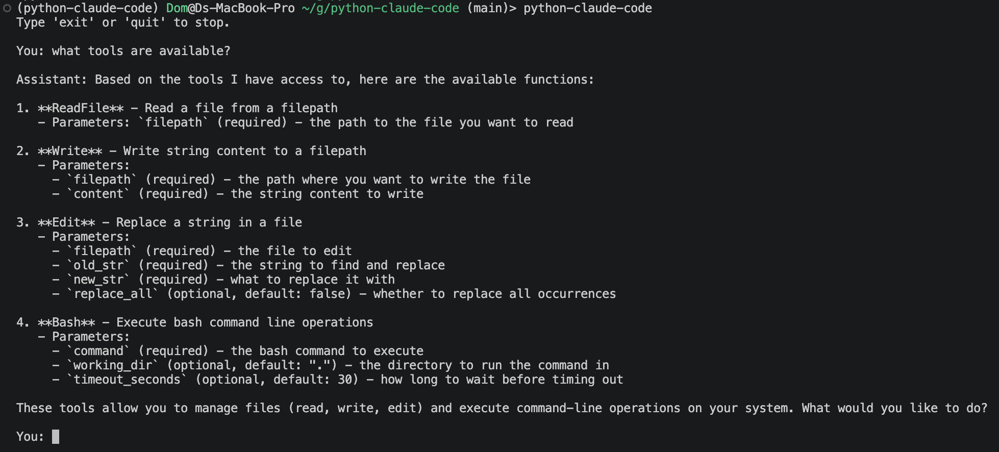

# Python Claude Code

##### 2026-09-28

(alternative title: "Read / Write / Edit / Bash")

 

## TL;DR

I wrote [my very own coding agent](https://github.com/domchao/python-claude-code), from scratch, in Python. 

## What is an AI Agent?

Mostly an open debate... but the definition I like, and that applies well here, is;

> An LLM with access to tools, running in a loop.

Large language models (LLMs) will, given an input, generate an output. You send an LLM a prompt and you get a response. You ask an LLM a question and you get an answer. 

They can "use tools" whereby if you include a tool definition in the input you send the model, and using the tool would help the model fulfil your request, the model output will say that it wants to use the tool, and give you the parameters the tool should be called with. 

This is incredibly powerful, and rests on both 'intelligence' and knowledge within the pre-trained base model and specific post-training (instructing) of these models to be able to use tools. Some of this I've descrbied earlier in my ["Demystifying LLMs"](../_1_demystifying_llms/_1_demystifying_llms.html) post, and some of which I'll deep dive into in a later blog specifically on reinforcement learning with verifiable rewards (RLVR). 

LLM tool use is what makes an AI agent. In the setting of a coding agent it can sometimes feel like magic, but I also think it's good to remember that at some level it's just tokens in and tokens out.

## Claude Code

Claude Code is Anthropic's coding agent. It uses the Claude models to help you perform coding tasks. It began the coding agent paradigm shift within software engineering, and when I used it for the first time it felt like a real light switch moment. Going from "tab auto-complete", and copy/pasting code to and responses from *just* an LLM chat application, to an actual coding agent like Claude Code was a huge leap. 

One of the striking things about Claude Code to me is it's simplicity, both on product and concept terms. Don't get me wrong there's a lot of complexity that is handled and abstracted but it is or feels simple in the best sense.

As a product it just works. It provides simplicity to the user.

As a concept - and this is where the simplicity really shines - it's basic aim of being a coding agent rested on being in the same place as human coders (the terminal), and having access to the same tools as them (bash / cli tools).

## Context engineering and harnesses

A blog post about AI Agents or coding agents wouldn't be complete without a little detour into talking about context engineering or harnesses. These three topics often go hand in hand, and for good reason. Here's some ways I like to think about it:

- The LLM, or the model, is the intelligence.
- **All** LLM interactions are about context engineering - how can you feed the right information into the model input so that you as the user can get the desired output. 
- Harnesses - in particular with reference to coding agents - are about more automatically getting the *right* context to the model, or allowing the model to be able to select the right context.

Imagine an LLM chat application. For some questions it will just "know" the answer, it will be within the model weights, because it's seen the answer in it's training data. For example: "What's the capital of France?". For some questions it will need extra context. For example: "Who did the Packers play last week?" - this temporal question won't be in the model's training data, but you as a user could give the model the current date and a season fixture list and the model should be able to work out the answer to the question, or the agent harness that the model sits in could allow it to perform web searches to get the right context to then give you the right answer.

Now when thinking about coding agents some of the context engineering of the harness could be providing the models with the right tools to do coding work (e.g. read and edit file tools), and some of it could be more automated (hard compaction or input limits rules to prevent over-filling the model context window). 

Coming back to what I like about the simplicity of the Claude Code concept, instead of it being a complex hand-crafted system of how to insert the right code repo context into the model input it just gave the models the right tools and said "Go grep the right context yourself" or in other words as a harness it "let the model cook".

## Two loops

My poor mans 'Python Claude Code' is a ~fully functioning, if a bit simple, coding agent. It's a Python REPL CLI tool, you run `python-claude-code` in your terminal, type your request, and it can navigate around and edit your codebase with `ReadFile`, `Write`, `Edit`, and `Bash` tools.

At it's core it runs two loops; an outer user interaction loop - where the user input is retrieved, and an inner agent loop - where the user message is sent to the model API and the assistant response is handled. Handling the assistant response essentially means; if the response contains tool calls, actually execute the tools and send the tool responses back to the model API (and keep doing that if more tool calls are asked for), before returning the final assistant response.

Here is Python Claude Code's (using `claude-haiku-4-5`) explanation of the two loops implemented in the codebase:

```
┌─────────────────────────────────────────────────────────────┐
│  OUTER LOOP: User Input Loop (Application Code)             │
│                                                             │
│  for each user message:                                     │
│    - Append user message to history                         │
│    - Call agent.loop(messages)                              │
│    ┌──────────────────────────────────────────────┐         │
│    │ INNER LOOP: Agent Loop (agent.loop)          │         │
│    │                                              │         │
│    │ while model is calling tools:                │         │
│    │   - Call agent.step(messages) for one API    │         │
│    │     call to the model                        │         │
│    │   - Extract assistant response               │         │
│    │   - If tools were called:                    │         │
│    │     • Run all tools in parallel              │         │
│    │     • Collect results                        │         │
│    │     • Append results to history              │         │
│    │     • Loop continues for next model call     │         │
│    │   - If no tools called (end_turn):           │         │
│    │     • Print final response                   │         │
│    │     • Break from inner loop                  │         │
│    │                                              │         │
│    └──────────────────────────────────────────────┘         │
│                                                             │
└─────────────────────────────────────────────────────────────┘
```

It read the codebase files to get the right context to *"Help me understand the different loops involved in the code for this coding agent"* - and even (unprompted) created a markdown summary of the answer with the above diagram, which was a nice surprise!

## Inspo

Credit where credit's due. 

Apart from Claude Code - which initially got me onto coding agents - the actual implementation of my 'Python Claude Code' borrowed heavily from the [Build your own AI agent from scratch](https://github.com/hugobowne/build-your-own-ai-assistant/tree/main) workshop that Hugo Bowne-Anderson from the Vanishing Gradients podcast ran with Ivan Leo.

Extra credit also goes to the Pi coding agent and [Mario Zechner's great blog](https://mariozechner.at/posts/2025-11-30-pi-coding-agent/) - I actually began this by wanting to make my own provider agnostic coding agent (or agent SDK - still undecided on which or exactly what form it will take), but then quickly backed-off to starting with implementing a provider-specific coding agent first.
